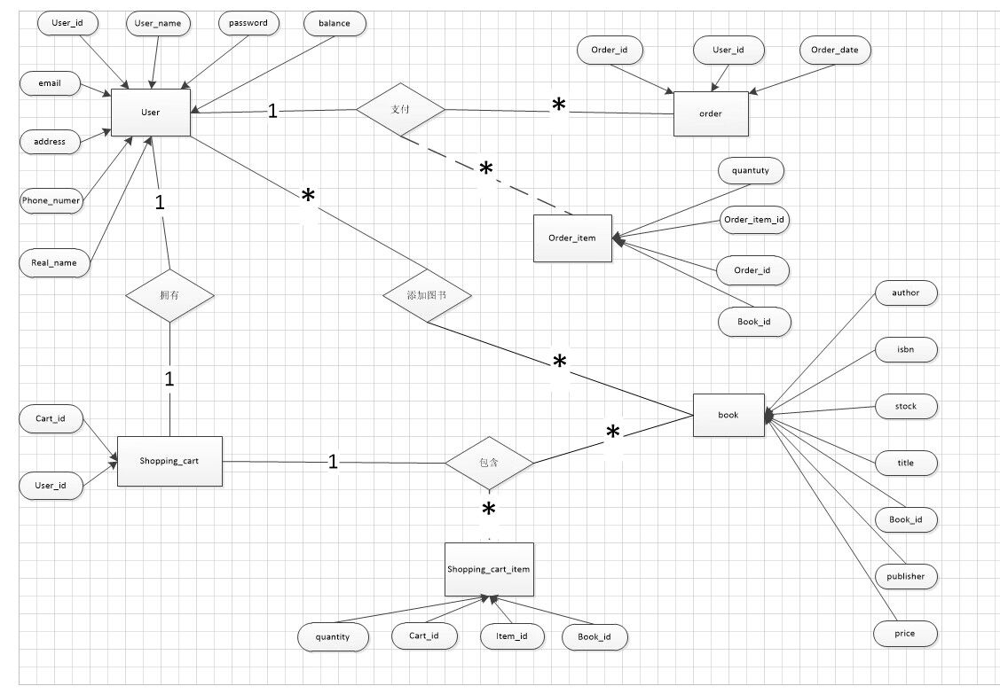

# 网上书店购物系统 - Online Bookstore


## 简介

欢迎来到我们独具创意的网上书店购物系统！这是一个不仅仅是购物，更是探索知识的奇妙之地。我们为您呈现的不仅是一系列精选图书，更是一场身临其境的文学冒险。

在这里，我们致力于将购书变成一次独特而愉悦的体验。我们的网上书店不仅提供丰富多彩的图书选择，而且注重每一位顾客的个性化需求。您可以在这里发现从经典巨著到独立小众作品的全方位图书馆，满足您多元化的阅读胃口。

我们的系统不仅仅是一个购物平台，更是一个与书籍亲密互动的社区。通过我们精心设计的用户界面，您将轻松畅游于文学海洋，发现那些或让人深思，或令人捧腹，又或是让人热泪盈眶的故事。我们相信，每一本书都是一个奇妙的世界，而您正是这个世界的主人。

此外，我们的购物系统不仅提供便捷的购书服务，更关注知识的传播和分享。您将获得关于图书、作者、文学流派等方方面面的丰富信息。我们不仅仅是卖书，更是为您提供一个全方位的文学文化体验。

无论您是狂热的书迷，还是初次踏足文学殿堂，我们都为您准备了丰富多彩的选择。让我们一同探索知识的海洋，让每一本书都成为您人生旅途中不可或缺的伴侣。

感谢您选择我们的网上书店购物系统，让阅读变得更有趣、更有深度！

## 入门篇

### 环境准备

- Spring boot (Spring + Spring MVC )
- Maven
- Mybatis (MySQL)
- Vue (HTML + JavaScript +CSS + Vuex + Router)
- axios
- Element UI
- ...

## 数据库

### ER图



### 数据库表

user 表

```mysql
CREATE TABLE user
(
    user_id      INT AUTO_INCREMENT PRIMARY KEY,
    user_name    VARCHAR(255) NOT NULL,
    password     VARCHAR(255) NOT NULL,
    real_name    VARCHAR(255) NOT NULL,
    email        VARCHAR(100),
    address      VARCHAR(255),
    phone_number VARCHAR(20),
    balance DECIMAL(10, 2) NOT NULL
);
```

book 表

```mysql
CREATE TABLE book (
   book_id INT AUTO_INCREMENT PRIMARY KEY,
   title VARCHAR(255) NOT NULL,
   author VARCHAR(255) NOT NULL,
   publisher VARCHAR(255) NOT NULL,
   isbn VARCHAR(13) NOT NULL,
   price DECIMAL(10, 2) NOT NULL,
   stock INT NOT NULL,
   type VARCHAR(50) NOT NULL
);
```

order表

```mysql
CREATE TABLE `order` (
  `order_id` int NOT NULL AUTO_INCREMENT,
  `user_id` int NOT NULL,
  `order_date` datetime NOT NULL, 
  PRIMARY KEY (`order_id`),
  FOREIGN KEY (`user_id`) REFERENCES `user`(`user_id`)  
);
```

order_item表

```mysql
CREATE TABLE `order_item` (
  `order_item_id` int NOT NULL AUTO_INCREMENT,
  `order_id` int NOT NULL,
  `book_id` int NOT NULL,
  `quantity` int ,
  PRIMARY KEY (`order_item_id`),
  FOREIGN KEY (`order_id`) REFERENCES `order`(`order_id`),
  FOREIGN KEY (`book_id`) REFERENCES `book`(`book_id`)
);
```

shopping_cart表

```mysql
CREATE TABLE shopping_cart (
  cart_id INT AUTO_INCREMENT PRIMARY KEY,
  user_id INT NOT NULL,
  FOREIGN KEY (user_id) REFERENCES user(user_id)
);
```

shopping_cart_item表

```mysql
CREATE TABLE shopping_cart_item (
  item_id INT AUTO_INCREMENT PRIMARY KEY,
  cart_id INT NOT NULL,
  book_id INT NOT NULL,
  quantity INT NOT NULL,
  FOREIGN KEY (cart_id) REFERENCES shopping_cart(cart_id),
  FOREIGN KEY (book_id) REFERENCES book(book_id)
);
```

### 数据库关系模式

1. 用户（**用户ID**，姓名，密码，真实姓名，邮箱，地址，电话，钱包金额）
2. 图书（ **图书ID**，书名，作者，出版商，ISBN，价格，库存，类型）
3. 订单（ **订单ID**，*用户ID*，订单时间）
4. 订单项（ **订单项ID**，*订单ID*，图书ID，图书数量）
5. 购物车（**购物车ID**，*用户ID*）
6. 购物车项（**购物车项ID**，*购物车ID*，*图书ID*，图书数量）

> 注：加粗为主键，斜体为外键

1. 用户表（user）

- 用户ID（user_id	Int	主键  ）
- 姓名（user_name    String）
- 密码（password    String）
- 真实姓名（real_name    String）
- 邮箱（email    String）
- 地址（address    String）
- 电话（phone_number    String）
- 钱包金额（balance    DECIMAL）

2. 图书表（book）

- 图书ID（book_id    Int    主键）
- 书名（title    String）
- 作者（author    String）
- 出版商（publisher    String）
- ISBN（isbn    String）
- 价格（price    DECIMAL）
- 库存（stock    int）
- 类型（type    String）

3. 订单（order）

- 订单ID（order_id    Int    主键）
- 用户ID（user_id    Int    外键关联user表（user_id））
- 订单时间（order_date   datetime）

4. 订单项（order_item）

- 订单项ID（order_item_id    Int    主键）
- 订单ID（order_id    Int    外键关联order表（order_id））
- 图书ID（book_id    Int    外键关联book表（book_id））
- 图书数量（quantity    Int）

5. 购物车（shopping_cart）

- 购物车ID（cart_id    Int    主键）
- 用户ID（user_id    Int   外键关联user表（user_id））

6. 购物车项（shopping_cart_item）

- 购物车项ID（item_id    Int    主键）
- 购物车ID（cart_id    Int    外键关联shopping_cart（cart_id））
- 图书ID（book_id    Int    外键关联book表（book_id））
- 图书数量（quantity    Int）

## 接口

1. ...
